# Documentation

# Index

- [Getting Started](#getting-started)
  - [Windows](#windows)
  - [Linux](#linux)
  - [macos](#macos)
- [Interface](#interface)
  - [Basic UI information](#basic-ui-information)
  - [Assets](#assets)
  - [Basic movement concepts](#basic-movement-concepts)
  - [Wiggle](#wiggle)
  - [Settings](#settings)
  - [Assigning Input keys](#assigning-input-keys)
  - [Save and Load](#save-and-load)
  - [Streamer Session](#streamer-session) (Still Work in progress, not recommended to use)
- [FAQ](#faq)

## Getting Started

Download the latest Version of PNGTuber-Remix  
[Download](https://github.com/MudkipWorld/PNGTuber-Remix/releases/latest)

### Windows

make sure you **downloaded** and **extracted** the correct zip archive  
> **not** the  Source code (zip|tar.gz) 

```
📂 PNGTubeRemix(Windows)
 ┣📄 DefaultTraining.tres
 ┣📄 GlobalInput.windows.template_release.x86_64.dll
 ┣📄 PNGTube Remix.console.exe
 ┣📄 PNGTube Remix.exe
 ┣📄 PNGTube Remix.pck
 ┣📄 WebsocketDocumentation.txt
 ┣📄 godotgif.windows.template_release.x86_64.dll
 ┣📄 libgcc_s_seh-1.dll
 ┣📄 libstdc++-6.dll
 ┣📄 libuiohook.dll
 ┗📄 libwinpthread-1.dll
```
just run the `PNGTube Remix.exe` file

### Linux

make sure you **downloaded** and **extracted** the correct zip archive  
> **not** the  Source code (zip|tar.gz) 

```
📂 PNGTubeRemix(Linux)
 ┣📄 GlobalInput.linux.template_release.x86_64.so
 ┣📄 PNGTube-Remix.pck
 ┣📄 PNGTube-Remix.sh
 ┣📄 PNGTube-Remix.x86_64
 ┣📄 libgodotgif.linux.template_release.x86_64.so
 ┗📄 libuiohook.so
```
then make the files executable
`chmod +x PNGTube-Remix.sh PNGTube-Remix.x86_64`
just run the `PNGTube-Remix.sh` file

### macOS

Due to macOS restrictions and code signing requirements, there is currently **no prebuilt release** available.  
Official support for macOS has therefore been discontinued.  

If macOS is still required, the application might can be built **manually from source** using the Godot engine.  
This is intended for advanced users who are comfortable compiling and troubleshooting on macOS.  

Things to keep in mind:  
- No ready to run downloads are provided  
- No guarantees for stability or compatibility  
- No official support or updates for this platform  

If that sounds acceptable, building it yourself is the only option.  
If not… well, other platforms exist.  

## Interface
### Basic UI information
#### Left Panel : 
##### Importing Assets: 
There are few different way to import your assets in PNGTube-Remix. one of the easiest way is from Files>Import then select the Object type you need.

Another quick way is from the buttons on top of the layers tree in the Left Panel.


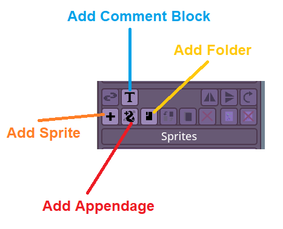


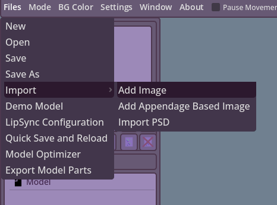

##### Image Preview:
You can Drag and Drop from your File Manager/ Images onto the Previews to set the Objects's Image or Normal Map to one of the Images you have imported there.
- Image : Previews your current selected Object.
- Normal Map : Previews the Normal Map of your selected Object.


##### Layers Tools:


##### Layers:


##### File Manager:


#### Right Panel : 
##### Properties : 

- Object Naming : You can rename your object after importing, when you finish, make sure to press enter for the change to apply
- Sprite ID and Parent ID : While for a users it is useless, it personally helps me debug issues users might be having with parenting and such.

- Color : Modulate/ Tints the object.

- Blend : Blend-Modes like Add, Multiply, etc  

- Z-Order : The order of the sprite, think of it like  
  Changing the layer of your drawings, but it is way  
  more free since it doesn’t fully depends on what  
  object it is connected/ linked to.  
  
- Pos-x, y and Rotation : You can manually change  
  the position and rotation from these.  
  
- Offset : Change the sprite’s rotation point.  

- Size-x, y : Changes the size of the object.  

- Visible : Changes the main visibility of the object.

- Flip Horizontally/ Vertically : Flips your Object and its children on the H or V axis.

- Assets : Will talk more about later.

- Cycles : Cycles are designed for users with so many assets that it becomes hard find good keybinds and such for. So for that case, you assign the assets to a cycle that you can toggle on/ off (randomly shows one of the items) or cycle through them forward or backward depending on the order. Will also discuss later.


---
**<center>Debug section</center>**

This section is designed for more test and general model optimization.  
  
Some users reported their models getting laggy and that is due to the amount of calculations running.  
  
The fix for that is being able to disable/ set the feature to rest mode.  
  
You can also use this section to toggle on something like Hidden Item, which makes it invisible in Preview mode, but its effects on children Objects still apply, etc.  

---
  
Now here is where things get interesting!
- Should Blink:
  if the Toggle is true, the object would be considered to be a part  
  of the eyes. Checking Eye Open means the current selected  
  object is/are open eyes, if unchecked, it means closed eyes.  
- Should Talk:  
  Same thing as the Eyes toggle, but for the mouth.  

You could always experiment with them. Despite thing software mainly  
focusing on rigging, this doesn’t mean you can’t make simple PNGTuber  
models like the ones seen in VeadoTube Mini and Gazō-Tuber  
(Links if you are curious, feel free to check them out too VeadoTube , Gazō  Tube).  


- Ignore Bounce:  
  Ignores Global bounce. Let’s say your sprite squishes, but you don’t want it to squish even more when the model bounces. You simply toggle this to prevent that from happening. Td;lr the part(s) don’t get affected if the model is bouncing, etc..
- Physics:  
If this is on, the object’s movement gets affected by the parent’s Y-axis movement. This could be used to add more flavor to your model!

#### Ignore Bounce Example:
|Ignore Bounce On|Ignore Bounce Off|


#### Physics Example:
|Physics On|Physics Off|


#### Clip Children:
> Sadly I am unable to find a good way to implement Clipping Masks.  
The only current way to clip stuff is to make the object a child of  
what you want to clip the object to and enable Clip Children on  
the parent object.  
This is a limitation I hope to be able to solve in the future 😇 

### Assets
Assets and Asset Toggles. Assets can be used on any Object Type. They are completely separate from States too. You need to keep in mind that an asset's toggle key and data is shared between all States.

- Is Asset : This is where you can make the Object an asset. Next to it is the keybind corresponding to this asset.
- Don't Hide : Asset toggles.. are toggles, but sometimes you don't want the asset to hide again by pressing the same toggle button.
- Show on Hold : This features make your asset only show as long as your toggle key is held. When released, the asset gets hidden again.
- Disappear key(s) : This feature is for assets that might need to be hidden by other assets being shown or for any general reason. the Key(s) is because you can assign more than one Disappear key to the same Asset Toggle(s).

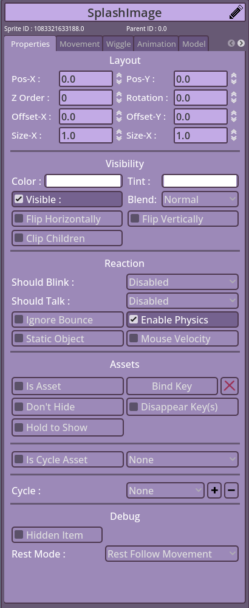

### Basic movement concepts
Movements in PNGTube-Remix work using the concept of Sine Movement/ Sine Waves.
- X-Amp : The amound of amplitude the object moves to on the x-axis.
- X-Freq : The frequency of movement on the object per second on the x-axis.
- Y-Amp : The amound of amplitude the object moves to on the y-axis.
- Y-Freq : The frequency of movement on the object per second on the y-axis.

- Drag : The amount of Weight/ drag you want to add to an object. The higher the Drag, the move weighted it feels.
- Drag Snap : Sometimes your object may move a lot between states which could lead to the Drag breaking your model due to the sudden position jump, this parameter fixes it by defining the max distance of the Drag before snapping to the current Object position.
- Stretch : the amound of stretch/ squish your object would have.
- Index X and Index Y : The dynamic change of the object's index depends on how close/ far the movement is from the origin.

- Min and Max Rot : the minimum and maximum rotation threshold the object can reach before stopping.
- Rot-Degree : The amount of rotation applied on the object.
- Rot-Freq : similar to Freq X and Y, but for rotation.
- Rot-Speed : the speed by which the Auto Rotation rotates in.
- Auto Rotate : Self explanitory..


**<center>Follow Section</center>**
- Follow Options : For the position, rotation and scale, you can choose different tracking options. Mouse, keyboard, etc..
- Delay : The amount of delay you want between your tracking and object reaching its target position.
- Range X and Y : How far (both positive and negative) should your object travel following your tracking movement. Values in the negative reverses the movement.
- Min-Rot and Max-Rot : the minmium and maximum amount of rotation your object should rotate depending on how close/ far it is from the tracked movement.
- Squish X and Y : Same as the rotation, but for the scale.
- Snaps : Position, Rotation and Scale snapping is for tracking like keyboard/ controller movement where it stays in place after the input stopped.

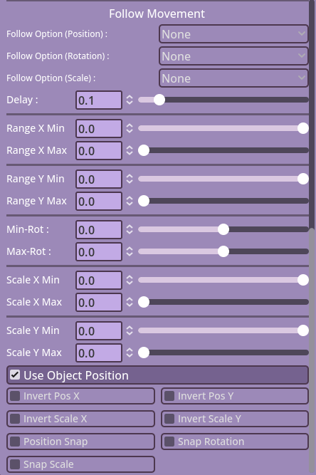

---
### Wiggle
**<center>Follow Appendage Tip</center>**
- Follow Appenage : If the Object is a child of an appendage, this feature allows the object to follow one of the appendage points. V1.4.1 onwards will allow you to reposition the object anywhere. Allowing the user to follow a specific point without being fully bound to it.
- Point : The point on which the object follows.
- Strength : The follow strength of the object (affects how harshly it rotates.)
- Rot-Threshold : The threshold of movement needed by the object to start following the rotation again.

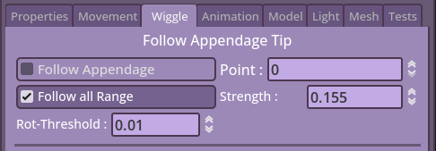


**<center>Wiggle Sprite</center>**
- Wiggle Sprite : Enables the sprites wiggling/ wobbling feature.
- Wiggle Physics : Enables physics on wobble sprites where the parent movement affects the wobbling.
- X and Y Offset : the offset position on the wiggling UV map (since this feature uses Shaders.)
- Wiggle Amp and Freq : Similar to the X and Y Amp/ Freq, but be careful since it is a bit more sensitive.

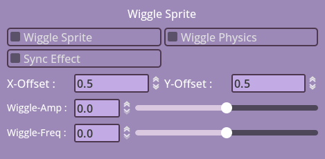


**<center>Wiggle Appendages</center>**
- Auto Wag : Enables auto wagging, this feature, however disables the Curvature. 
- Curvature : The amount of curve applied on your appendage, good for curly hair pieces or tails.
- Segments : The amount of segments your appendage has, each segment is equal in size and has sub-divisions applied to each equally.
- Stiffness : How soft/ stiff the appendage is to movement.
- Phys-Stiff : This features defines how much stiffness the parent's movement effect should be on the child (appendage.)
- Comeback : The comeback speed of the appendage to its rest position.
- Momentum : The angular momentum of the appendage. in simple terms, how hard the movement is.
- Damp : How snappy it is while moving/ going to rest position.
- Width and Length : do i need to say anything?
- Gravity X and Y : The gravity can be either positive or negative, this could make the appendage attempt to float up or fall down by being pulled by the gravity.
- Sub-Division : The amount of divisions/ points on your appendage per segment.
- Angle : This can be used to rotate the appendage/ set its angle without having to fully rotate the object.
- Closed Loop : Closes your appendage into a loop. Connects the beginning with the end.
- Keep length and Max Stretch : These two are related, since sometimes, you may not want your appendage to stetch past a threshold/ keep its length, these two parameters are for that.
- Anchor : The target anchor for the appendage turning it into a rope. Note : if two target objects share the same name, only the first one will appear on the list, keep that in mind..
- Texture mode :  Either stretch the texture onto the appendage or tile it, tiling can be useful for something like chains.
- Mirror Reaction H : Honestly, don't remember, need to check the code again. I think it was a test feature I forgot to remove.
  
Remember to check [Original Wiggle Appendage](https://github.com/Tameno-01/GodotWigglyAppendage2D).  
Check this [Basic Appendage Parameters for Artists](https://github.com/Tameno-01/GodotWigglyAppendage2D/blob/main/docs/parameter_decriptions.md)  


---
### Animation
This section is for controlling the Sprite-Sheet, Gif and APNG animations and few misc stuff.
- Horizontal and Vertical Animation Frames : these are used for Sprite-Sheets, can be used on horizonal, vertical or grid sheets.
- Animation Speed : The speed in which your animated sheet plays.

- Reset Animation : Resets the animation if it was hidden then shown again.
- One shot : Makes the animation only plays once if hidden then shown again.
- Reset on State Change : Similar to Reset Animation, but only if the State is changed.

- Rainbow : Enables the RGB/ Rainbow Effect
- Self Rainbow : Only makes the effect work on the Object and not its children.
- Rainbow Speed : The speed of the RGB cycling.


**<center>Sprite-Sheet Specifics</center>**
- None Animated Sheet : This feature freezes the Sheet, so you can pick which frame you want to show. Useful for customizable models.
- Frame : The frame of the frozen sheet you want to show.
- Animate to mouse : You may want to animate your sheet to the mouse/ Tracking X/ Y movements.
- Move with Mouse : You can disable the movement with the tracking which makes the sheet stay in place, but still cycles through its animations with the movement.
- Animation Speed : How fast the frame cycles to the tracked movement.

**<center>Misc Animations</center>**
- Fade : Makes the Object fade in/ out whe being hidden/ shown.
- Fade Asset : Same as Fade, but only on Assets.
- Fade (Slider) : The Speed of the fade.
- Fade Asset (Slider) : The Speed of the Asset Fade.

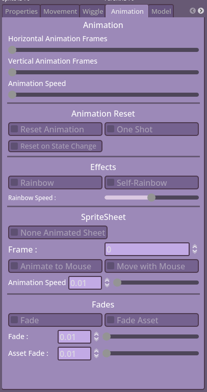
---
### Model
**<center>Model Animations</center>**
- Mouth Closed/ Open : Either of these lets you choose the animations you want to apply on the model when talking/ not talking.

- Bounce Amount  : The amount of force your model jumps when the Bounce or Bounce Once are used.
- Bounce Gravity : The amount of gravity/ pull force that the model falls by after bouncing.

- X-Frequency Wobble : The Frequency of the Model Shaking on the x-axis.
- X-Amplitude Wobble : The Amplitude/ Height of the Model Shaking on the x-axis.
- Y-Frequency Wobble : The Frequency of the Model Shaking on the y-axis.
- Y-Amplitude Wobble : The Amplitude/ Height of the Model Shaking on the y-axis.

- Bounce When State Changes : Makes your model bounce on changing states. Completely dependent from the Model Animations.

**<center>Eye Animations</center>**
- Blink Speed  : The Speed of the Model blinking.
- Blink Chance : The Blink chance (1 in x chance for blinking)

- Squish Amount   : The amount of squish applied to your model at the center of the Sprite Holder.
- Squish on Blink : Enables the Squishing feature when the model blinks.

**<center>Effects</center>**
- Color-Blindness Helper : This was a feature requested to help make your model visually friendly to people with color-blindness.
- Model Effects : Some effects to you apply on your entire Model, not per Object.


---
### Light
Light can be used with the Normal Maps feature to give your model a dynamic light effect. Lights can still be used without Normal Maps, however.

- Light Visible : Enables/ disables the Light feature.
- Light Shape Visible : Shows where the Light is coming from using a small light indicator.

- Light Color : The color of the Light source.
- Darken : Darkens your model when not talking. When speaking, your model becoming lighter again then fades back to darkened.
- Darken Color : Next to the toggle, you change the darkening color.

- Pos-X : The position of the light source on the x-axis.
- Pos-Y : The position of the light source on the y-axis.

- Blend : The blend mode of the Light source (Mix, Add, Subtract).

- Light Energy : The energy of the emitted light from the source.
- Light Size : The size of the Light source.

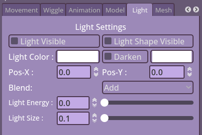

---
### Mesh
Sorry, I broke it. Just kidding, I am still working on it.

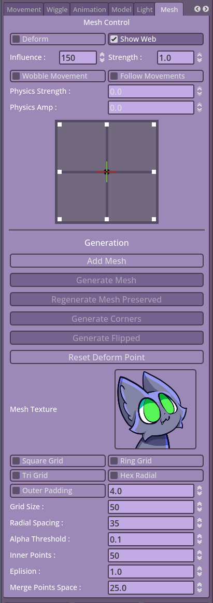

---
### Test
Here, new features are usually added for testing before becoming official. Honorable mention : Advanced Lipsync.

---
### Assigning Input keys and Naming States
In V1.4 onwards, assigning Input Keys/ renaming States is done from the Remap button ontop of the states as shown here, not from settings. Don't forget to press enter after renaming your State.


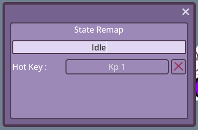

---
### Websocket
For better info about the Websocket, check this [Websocket Documentation](https://github.com/vj4sothername/PNGTuber-websocket-documentation/blob/main/WebSocket_API_Documentation.md)

Special thanks for vj4 for the feature!

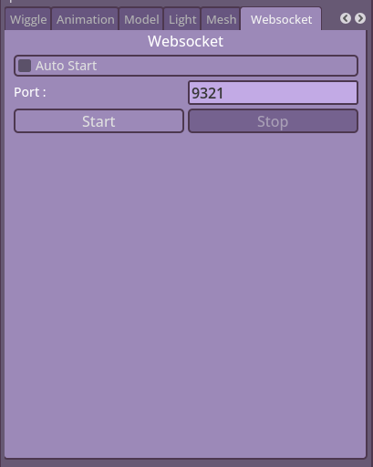

---
### Settings
- UI Theme : Changes the theme/ UI colors.

#### Model
- Detect Hotkeys : Enables/ Disable the Hotkeys detection.
- Anti-Aliasing : Enables/ Disables the anti-aliasing on the entire model.
- Auto-load Model : Auto loads your model between sessions.
- Use DeltaTime : Uses physics ticks instead of advancing the physics by 1 per frame.
- Save on Exit : Auto saves your model when closing the software.
- Auto-Save : Auto saves your model after x amount of mins.
- Max-FPS : The max FPS that the software can run on, by default, the software uses 60 FPS.
- Follow Mouse Screen : The Screen which the follow mouse mainly focuses on when detecting the mouse position.
- Snap Out of Bounds : Disables the mouse position detection if it is out of the selected screen.

#### Audio
- Volume : The threshold for the volume for detecting your speech.
- Delay : The threshold/ delay of your mouth
- Volume Sensitivity : Increases the sensitivity of the microphone detection.
- Microphone : This is where you can select your microphone of choice.
- Restart Microphone : This was added to restart the microphone if it stopped working.

#### Import
- Crop Images to Content : Trims/ Crops the transparent area around the images you import.
- Keep Data Before Trim/ Crop : 

#### Remix Settings
- UI Scale : Scales up or down your UI depending on your needs.
- Floaty Panning : Enables/ Disables floaty/ Snappy camera panning using the middle mouse button.
- Fancy Cursor in Editor/ Preview : Custom cursors for editor or preview.
- Save Unused Files : In the File Manager, you may have unused assets, you can enable this toggle to still save the unused data in the save file.
- Language : Language.
- Tracking Backend : The Global Input/ Shortcut backends system, choose what fits you (Note : Wayland can be a pain to use with this).
- Audio Backend : Two different Audio input methods, use what feels better for your use.

---
### Save and Load
To Save and Load your model, you go to Files > Save/ Files > Save As and for loading, you go to File > Open.


---
### Streamer Session
(Still Work in progress, not recommended to use if you have a version with the feature enabled. It is currently Disabled.)

---
## FAQ

- I don’t know how to use this with OBS!  
  Open your model under FIles > Open  
  Set BG Color at the Top Bar to Transparent  
  Set Mode at the Top Bar to PNGTube  
  Add Game Capture in OBS  
  Allow transparency in Game Capture options  
  Capture PNGTube Remix  

- My mic doesn’t seem to be picking up no matter what I do?  
  This is a problem with Godot and picking up microphones with more than  
  two channels, not sure what can be done outside of maybe faking a 2  
  channel mic with an application like Voicemeeter Banana.  

- I’m trying to set up Advanced Lip Sync and there is only one phoneme…  
  In the lip sync config tab, go to Files > New File in the top right corner  
  and then Files > Save to save it over the broken default one.  

- I opened up an image/model and there’s a giant black square!  
  Remix seems to have different limits for image sizes depending on your   
  computer, this is especially apparent for giant image files like if you  
  didn’t crop the empty space from your sprite sheets. Keep this in mind when  
  creating a model for another person.  

- I can’t seem to use hotkeys on Linux when Remix isn’t focused! (Steam Deck runs on Linux)  
  Wayland (The protocol used for handling stuff like hotkeys on Linux)  
  doesn’t currently allow for global inputs without some editing due to  
  security reasons (or it might just not work at all.)  
  You can try enabling Legacy X11 App Support or launching the program with Xwayland.  

- My mouth isn’t opening and closing properly! (Includes Advanced Lip Sync)  
  Most commonly this is a problem with the audio settings you have,  
  make sure you have the mic you’d like to use selected and fiddle with  
  the volume sensitivity and threshold inside of the volume bar until you have the desired effect.  

- Clipping isn’t working properly!  
  Clipping is done through objects that are parent-child and  
  the child MUST have Z-order value of 0 (It’s near the top of the properties tab.)  
  Remember that the last object attached to the parent will appear in front of the others.  
  You also can’t clip something to a clipped object.  

- I can’t unparent an object!  
  Drag it to the model folder at the top of the sprite list.  

- My sprite sheet frames are cutting into each other!  
  To function as spritesheets, each frame of your animation must  
  have the same amount of space allocated to it. Otherwise the  
  frames will cut into each other! Use frames of uniform size and  
  if you must, use an online texture packer.  

- How do I record sounds for Advanced Lip Sync?  
  Add a new recording slot with the Plus symbol.  
  Then press and release the mic icon, it will record  
  for a split second after it is released.  
  Make sure you only record the viseme and not the  
  surrounding parts of the example words,  
  some sounds will be hard but just do your best.  

- How big should I make my images for the model?  
  Try to think of the scale you’ll be using your model in,  
  no point in making a 4k model if you’re only streaming in 720p.  
  Try not to go overboard either or you can run into issues with performance  
  or if they’re really big, the black box glitch. If you’re still struggling to decide  
  a canvas size of around 1000-2000 px is a decent place to start.  
